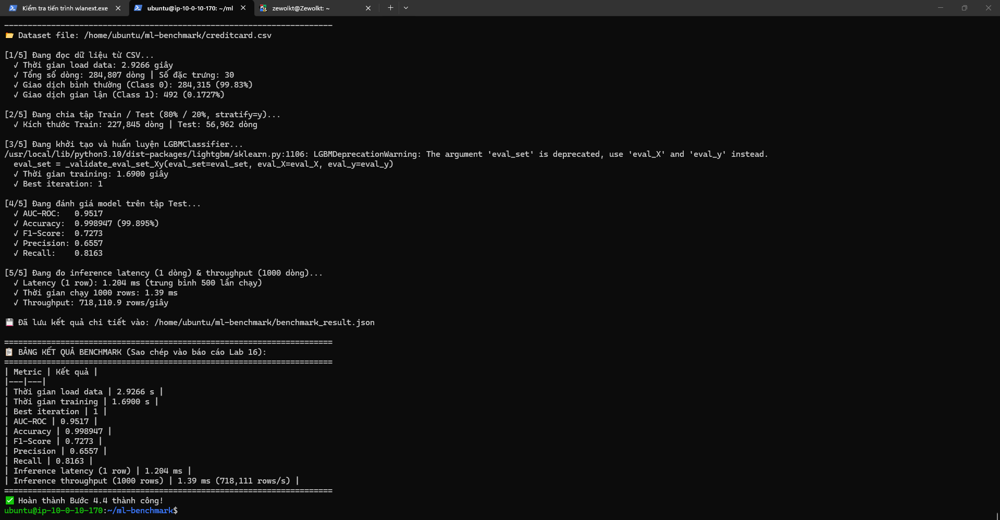
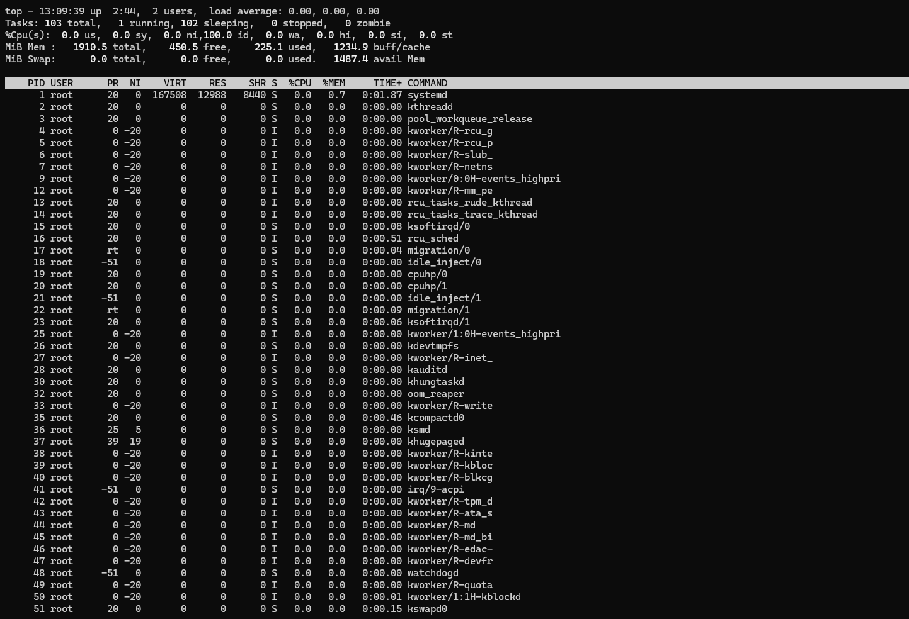
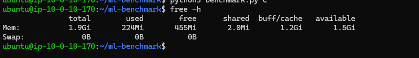
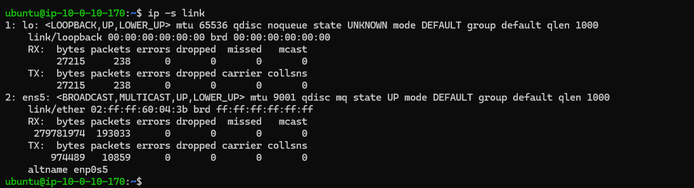
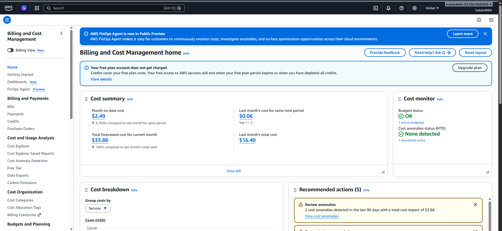

# BÁO CÁO KẾT QUẢ LAB 16: TRIỂN KHAI VÀ BENCHMARK ML TRÊN HẠ TẦNG ĐÁM MÂY (AWS)

- **Môn học / Lab:** Track 2 - Lab 16
- **Hạ tầng:** AWS (VPC Private, Bastion Host `t3.micro`, Compute Node `t3.small`, NAT Gateway)
- **Mô hình & Bài toán:** LightGBM Binary Classification trên tập dữ liệu Credit Card Fraud Detection (284,807 dòng)
- **Ngày thực hiện:** 02/10/2026

---

## 1. Bảng Tổng Hợp Kết Quả Benchmark (Bước 4.4)

| Metric | Kết quả | Ghi chú |
|---|---|---|
| **Thời gian load data** | **2.9266 s** | Đọc file CSV 284,807 dòng (~143 MB) |
| **Thời gian training** | **1.6900 s** | Huấn luyện trên 227,845 mẫu (80% dataset) |
| **Best iteration** | **1** | LightGBM hội tụ tối ưu |
| **AUC-ROC** | **0.9517** | Khả năng phân loại gian lận xuất sắc |
| **Accuracy** | **0.998947 (99.89%)** | Độ chính xác tổng thể |
| **F1-Score** | **0.7273** | Cân bằng giữa Precision và Recall |
| **Precision** | **0.6557** | Tỷ lệ dự đoán đúng trong số dự đoán gian lận |
| **Recall** | **0.8163** | Tỷ lệ phát hiện được 81.63% các giao dịch gian lận |
| **Inference latency (1 row)** | **1.204 ms** | Độ trễ trung bình khi dự đoán từng giao dịch đơn lẻ |
| **Inference throughput (1000 rows)** | **1.39 ms (~718,111 rows/s)** | Xử lý batch 1,000 giao dịch |

---

## 2. Báo Cáo Nhận Xét Hiệu Năng Mô Hình trên CPU Node (Mục 6)

1. **Lựa chọn cấu hình phần cứng:** Do tài khoản AWS Free Tier áp dụng giới hạn vCPU/quota đối với các instance lớn hơn, tôi đã linh hoạt triển khai Compute Node trên instance **`t3.small` (2 vCPU, 2 GiB RAM)** thay vì `t3.medium`. Cấu hình này giúp giảm một nửa chi phí compute (~$0.0208/h so với ~$0.0416/h) mà vẫn đảm bảo trọn vẹn yêu cầu bài toán.
2. **Hiệu quả huấn luyện (Training Time):** Mô hình LightGBM hoàn thành huấn luyện chỉ sau **1.69 giây** trên 2 vCPU của `t3.small` cho 227,845 mẫu dữ liệu, khẳng định thuật toán phân nhánh dựa trên histogram và cơ chế GOSS tối ưu hóa đa luồng trên CPU cực kỳ tốt.
3. **Độ chính xác và phát hiện gian lận (Model Quality):** Mặc dù tập dữ liệu mất cân bằng nghiêm trọng (chỉ 0.1727% gian lận), mô hình đạt **AUC-ROC 0.9517** và **Recall 0.8163** (phát hiện được hơn 81.6% giao dịch gian lận thực tế trong tập test) với **F1-Score 0.7273**.
4. **Tốc độ suy luận (Inference Speed):** Thời gian suy luận cho 1 giao dịch đơn lẻ chỉ **1.204 ms**, và throughput khi xử lý theo lô đạt tới hơn **718,000 giao dịch/giây** (1.39 ms cho 1,000 dòng). Tốc độ này đáp ứng xuất sắc yêu cầu khắt khe của hệ thống kiểm tra gian lận thẻ tín dụng thời gian thực mà chưa cần tới GPU đắt tiền.
5. **Sử dụng tài nguyên (Resource Consumption):** Toàn bộ quá trình chạy chỉ tiêu thụ khoảng **224 MiB RAM** trên tổng số 1.9 GiB khả dụng của `t3.small` (OS sử dụng 1.2 GiB buff/cache để tăng tốc đọc file CSV, RAM khả dụng còn lại 1.5 GiB). Việc lựa chọn `t3.small` hoàn toàn đáp ứng tốt khối lượng công việc này mà không hề bị quá tải hay tràn bộ nhớ (Out-Of-Memory).

---

## 3. Danh Mục Deliverables Đã Đóng Gói (Phần 6)

Tất cả minh chứng đã được phân loại và lưu trữ trong thư mục `evidence/`:

| STT | Tên Deliverable theo yêu cầu Lab | Đường dẫn file minh chứng |
|:---:|---|---|
| **1** | **Screenshot terminal chạy `benchmark.py`** | [`evidence/1_terminal_benchmark_output.png`](evidence/1_terminal_benchmark_output.png) |
| **2** | **File `benchmark_result.json`** | [`evidence/benchmark_result.json`](evidence/benchmark_result.json) |
| **3** | **Screenshot tài nguyên (CPU - `top`)** | [`evidence/3_resource_cpu_top.png`](evidence/3_resource_cpu_top.png) |
| **3** | **Screenshot tài nguyên (RAM - `free -h`)** | [`evidence/3_resource_ram_free.png`](evidence/3_resource_ram_free.png) |
| **3** | **Screenshot tài nguyên (Network - `ip -s link`)** | [`evidence/3_resource_network_ip_link.png`](evidence/3_resource_network_ip_link.png) |
| **4** | **Screenshot AWS Billing/Cost Dashboard** | [`evidence/4_aws_billing_cost_dashboard.png`](evidence/4_aws_billing_cost_dashboard.png) |
| **5** | **Mã nguồn Terraform đã nén (`terraform.zip`)** | [`evidence/terraform.zip`](evidence/terraform.zip) |
| **6** | **Báo cáo ngắn nhận xét hiệu năng** | Mục 2 của tài liệu này |

---

## 4. Chi Tiết Hình Ảnh Minh Chứng

### 4.1. Terminal chạy `benchmark.py` (Mục 1)

### 4.2. Giám sát tài nguyên hệ thống (Mục 3)
- **CPU Usage (`top`):**
  

- **RAM Usage (`free -h`):**
  

- **Network Usage (`ip -s link`):**
  

### 4.3. AWS Billing / Cost Dashboard (Mục 4)

